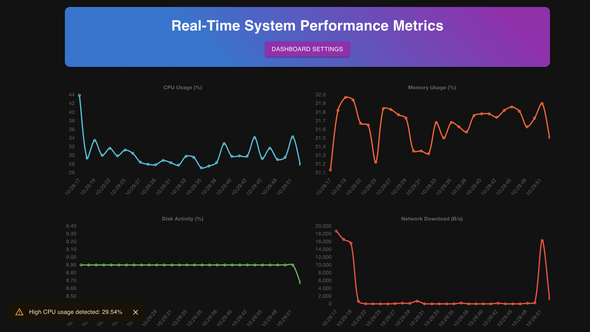

# Real-Time System Performance Dashboard

## Overview

The Real-Time System Performance Dashboard is a full-stack web application designed to monitor and visualise system performance metrics in real-time. It provides users with an interactive interface to track CPU usage, memory usage, disk activity, network speeds, and more, facilitating prompt identification of potential system issues.

## Features

- **Real-Time Monitoring:** Utilises Socket.io to provide instantaneous updates of system metrics.
- **Interactive Visualisations:** Displays metrics through dynamic charts using Chart.js.
- **Customisable Dashboard:** Allows users to select which metrics to display and adjust the data refresh rate.
- **Alerts and Notifications:** Implements alert mechanisms to notify users when specific metrics exceed predefined thresholds.
- **Responsive Design:** Ensures optimal viewing experiences across various devices with Material UI components.

## Tech Stack

- **Frontend:**
  - [React](https://reactjs.org/): A JavaScript library for building user interfaces.
  - [TypeScript](https://www.typescriptlang.org/): A statically typed superset of JavaScript.
  - [Material UI](https://mui.com/): A React component library implementing Google's Material Design.
  - [Chart.js](https://www.chartjs.org/): A JavaScript library for data visualization.
  - [Socket.io Client](https://socket.io/): For real-time, bidirectional communication between web clients and servers.

- **Backend:**
  - [Node.js](https://nodejs.org/): A JavaScript runtime built on Chrome's V8 engine.
  - [Express](https://expressjs.com/): A minimal and flexible Node.js web application framework.
  - [Socket.io Server](https://socket.io/): Enables real-time, bidirectional communication between web clients and servers.
  - [Systeminformation](https://systeminformation.io/): A Node.js module to retrieve system and hardware information.
 

## Usage

1. **Access the Dashboard:** Open `http://localhost:3000` in your web browser.
2. **Customise Display:** Use the "Dashboard Settings" button to select which metrics to display and set the data refresh rate.
3. **Monitor Alerts:** The dashboard will display notifications if any metric exceeds its predefined threshold.

## License

This project is licensed under the MIT License. See the [LICENSE](./LICENSE) file for details.

